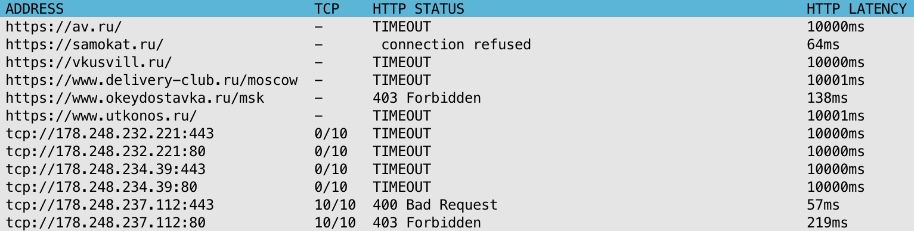
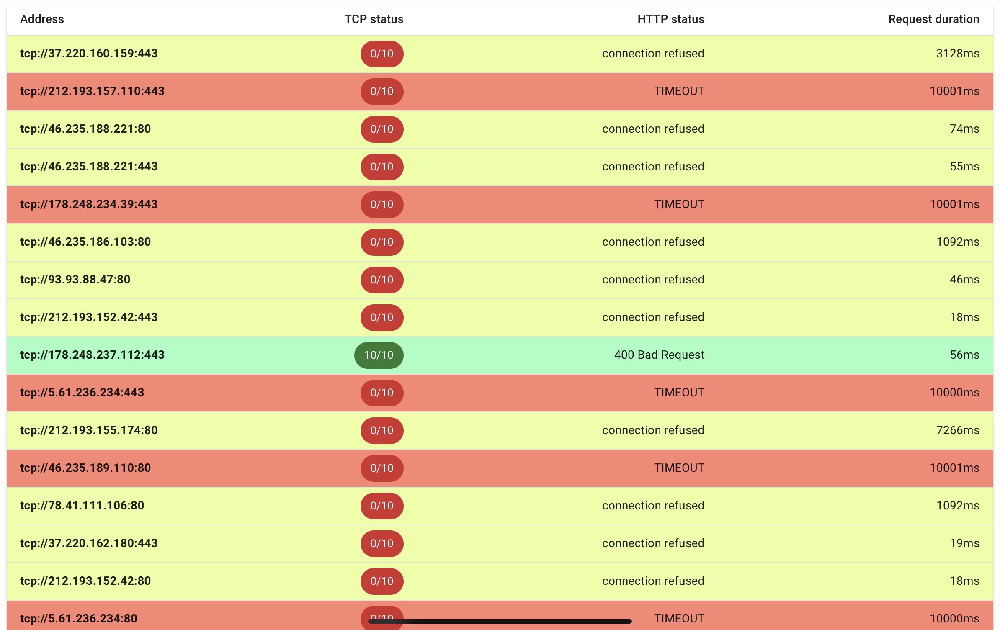

# HostMonitor

A simple utility to monitor host availability by given config.

### Installation:
```bash
source <(curl https://raw.githubusercontent.com/Kashkovsky/hostmonitor/main/install.sh)
```

### Usage:

#### Run as a CLI tool to display test metrics in terminal:

```bash
hostmonitor watch [flags]
```



#### Run as a web server:

Web UI will be available at `http://localhost:8080`.
The default port can be changed with a `-p` flag.

```bash
hostmonitor serve [flags]
```



### Flags:

**-c** or **--configUrl**: [string] Url of config containing url list (default "https://raw.githubusercontent.com/Kashkovsky/hostmonitor/main/itarmy_targets.txt"). Either remote url or local file path are accepted.

**-h** or **--help**: help for a command (e.g. `hostmonitor serve -h`)

**-t** or **--requestTimeout**: [int] Request timeout in seconds (default 5)

**-i** or **--testInterval**: [int] Interval between test updates in seconds (default 10)

**-u** or **--updateInterval**: [int] Config update interval in seconds (default 600)

**-p** or **--port**: [int] Server port (default 8080, **for web server only**)

#### Examples:
```bash
# Run CLI, read urls from local file:
./hostmonitor watch -c ./my-config.txt

# Run server with remote config:
./hostmonitor serve -c https://mydomain.com/urls.txt
```
